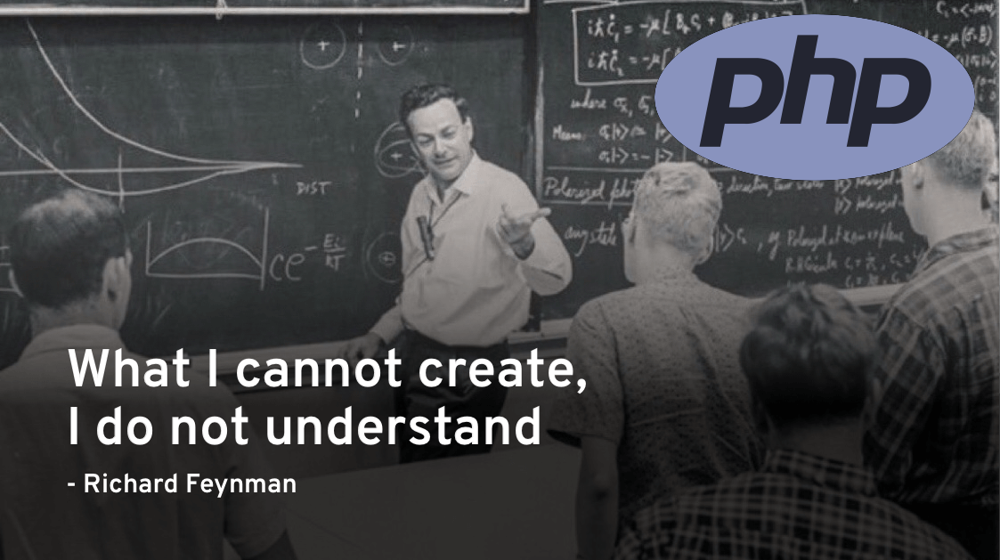

# 

Inspired by [https://github.com/danistefanovic/build-your-own-x](https://github.com/danistefanovic/build-your-own-x)

#### Build your own `Blockchain / Cryptocurrency`

* [_Minimal working blockchain implemented in PHP_](https://github.com/akondas/php-blockchain)

#### Build your own `Bot`

* [_A framework agnostic PHP library to build chat bots_](https://github.com/botman/botman)

#### Build your own `Emulator`

* [_A PHP Terminal GameBoy Emulator_](https://github.com/gabrielrcouto/php-terminal-gameboy-emulator)

#### Build your own `Game`

#### Build your own `Git`

#### Build your own `Network Stack`

#### Build your own `Neural Network`

#### Build your own `Operating System`

#### Build your own `Physics Engine`

#### Build your own `Programming Language`

#### Build your own `Regex Engine`

#### Build your own `Search Engine`

#### Build your own `Shell`

#### Build your own `Template Engine`

#### Build your own `Text Editor`

#### Build your own `Web Search Engine`

* [**PHP**: _Code a Search Engine in PHP_](https://boyter.org/2013/01/code-for-a-search-engine-in-php-part-1/)

#### Build your own `Web Server`

* [**PHP**: _Writing a webserver in pure PHP_](http://station.clancats.com/writing-a-webserver-in-pure-php/)

#### Uncategorized

* [**(any)**: _From NAND to Tetris: Building a Modern Computer From First Principles_](http://nand2tetris.org/)

## How to contribute

Contributions are very welcome: [Submit tutorial](https://github.com/akondas/build-your-own-x-in-php/issues/new)

## License

This project is released under the MIT Licence. See the bundled LICENSE file for details.

## Author

Arkadiusz Kondas (@ArkadiuszKondas)
